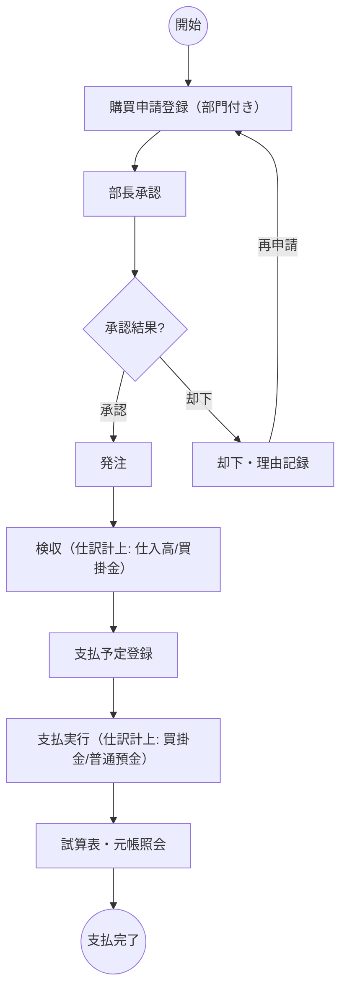

# purchase-kaikei — Basic Design

# 0. Canonical Spec (YAML SSoT)

```yaml
basic_design:
  feature_id: FEAT-PURCHASEKAIKEI
  profile: enterprise-erp
  version: 2
  need:
    - RQ-PURCHASEKAIKEI-001
    - RQ-PURCHASEKAIKEI-002
  solution:
    - US-PURCHASEKAIKEI-001
    - US-PURCHASEKAIKEI-002
    - US-PURCHASEKAIKEI-003
    - US-PURCHASEKAIKEI-004
    - US-PURCHASEKAIKEI-005
    - US-PURCHASEKAIKEI-006
  stakeholders:
    owner: 研修受講者 (Liu Yutong)
    dev: AI agent (Claude Code)
    approver: 研修受講者本人
  value: 購買フロー全段階の仕訳自動計上と、購買×会計の画面上突合
  context: 研修用・ローカル実行・単体完結（会計機能は内蔵エンジン・外部 API 連携なし）・管理会計 (kanri-dwh) は対象外
  change: 検収・支払の状態遷移を仕訳として帳簿に自動反映
  delivery_model: single-user-local-web-app
  traceability_rows:
    - {rq: RQ-PURCHASEKAIKEI-001, us: US-PURCHASEKAIKEI-001, ac: AC-US-PURCHASEKAIKEI-001-01, bpmn: BPMN-TASK-001, ct: CT-API-PURCHASEKAIKEI-001, test: TS-INT-PURCHASEKAIKEI-001, task: WI-PURCHASEKAIKEI-002}
    - {rq: RQ-PURCHASEKAIKEI-001, us: US-PURCHASEKAIKEI-002, ac: AC-US-PURCHASEKAIKEI-004-03, bpmn: BPMN-TASK-005, ct: CT-API-PURCHASEKAIKEI-005, test: TS-INT-PURCHASEKAIKEI-005, task: WI-PURCHASEKAIKEI-004}
    - {rq: RQ-PURCHASEKAIKEI-001, us: US-PURCHASEKAIKEI-003, ac: AC-US-PURCHASEKAIKEI-005-03, bpmn: BPMN-TASK-007, ct: CT-API-PURCHASEKAIKEI-005, test: TS-E2E-PURCHASEKAIKEI-001, task: WI-PURCHASEKAIKEI-004}
    - {rq: RQ-PURCHASEKAIKEI-002, us: US-PURCHASEKAIKEI-004, ac: AC-US-PURCHASEKAIKEI-006-01, bpmn: BPMN-TASK-008, ct: CT-API-PURCHASEKAIKEI-006, test: TS-INT-PURCHASEKAIKEI-006, task: WI-PURCHASEKAIKEI-005}
    - {rq: RQ-PURCHASEKAIKEI-002, us: US-PURCHASEKAIKEI-005, ac: AC-US-PURCHASEKAIKEI-006-02, bpmn: BPMN-TASK-008, ct: CT-API-PURCHASEKAIKEI-006, test: TS-INT-PURCHASEKAIKEI-006, task: WI-PURCHASEKAIKEI-005}
    - {rq: RQ-PURCHASEKAIKEI-001, us: US-PURCHASEKAIKEI-006, ac: AC-US-PURCHASEKAIKEI-001-02, bpmn: BPMN-TASK-001, ct: CT-API-PURCHASEKAIKEI-001, test: TS-INT-PURCHASEKAIKEI-001, task: WI-PURCHASEKAIKEI-003}
```


## #0 Need (なぜ)

- RQ-PURCHASEKAIKEI-001: 購買管理（purchase-management）と財務会計（kaikei-api）が別々に動いており、検収・支払の実績が帳簿（仕訳）に自動で反映されず、二重入力や記録漏れが起きる。
- RQ-PURCHASEKAIKEI-002: 購買の状態（検収済み・未払い）と会計帳簿（残高試算表・総勘定元帳）を画面上で突き合わせて確認できない。

## #1 Solution (何を)

- US-PURCHASEKAIKEI-001: ユーザーとして購買フロー（申請→承認/却下→再申請→発注→分割検収→支払予定→支払）を画面上で完走できる。purchase-management の全機能を引き継ぐ。
- US-PURCHASEKAIKEI-002: 管理担当として、検収 1 回ごとに仕訳（借方: 仕入高 5110 / 貸方: 買掛金 2110、金額 = 検収数量 × 単価）が内蔵会計エンジンにより自動計上される。仕訳 id は購買記録に保持する。
- US-PURCHASEKAIKEI-003: 管理担当として、支払実行時に仕訳（借方: 買掛金 2110 / 貸方: 普通預金 1120、金額 = 支払額）が内蔵会計エンジンにより自動計上される。
- US-PURCHASEKAIKEI-004: ユーザーとして、内蔵会計エンジンが計算した残高試算表（残高 0 科目も含む）を画面で照会できる。
- US-PURCHASEKAIKEI-005: ユーザーとして、科目別の総勘定元帳（内蔵会計エンジンが計算）を画面で照会できる。
- US-PURCHASEKAIKEI-006: 申請者として、購買申請に部門（D10 営業部 / D20 開発部 / D90 管理部・既定 D90）を付与でき、部門は仕訳の department に引き継がれる。

## bpmn_descriptions

`process.bpmn` の生成正本（この節を編集してジェネレータ経由で再生成する。process.bpmn の手書き編集は guard により block）。役割レーンは操作者（申請者 / 部長 / 管理担当）に対応。



| レーン | ノード |
|---|---|
| 申請者 | S, T1 |
| 部長 | A1, G1, R1 |
| 管理担当 | J1, T4, T5, T6, T8, E1 |

## #2 Stakeholders (誰が)

| Role | Person | Phase 関与 | RACI+ |
|---|---|---|---|
| Owner | 研修受講者 (Liu Yutong) | All | A |
| Dev | AI agent (Claude Code) | Phase 4 | R |
| Approver | 研修受講者本人 | All Gates | A |

## #3 Value (何を達成)

- 検収・支払のたびに帳簿が自動で更新され、購買と会計の数値が一致する（手動仕訳入力ゼロ）。
- 残高試算表・総勘定元帳が購買画面と同じアプリ内で照会できる。

## #4 Context (前提条件)

- 研修用・ローカル実行。purchase-management（Node.js + Express + JSON 永続化）を土台にする。
- **v2: 単体で完結する。** 会計機能（仕訳台帳・試算表・総勘定元帳）は内蔵エンジンで実装し、外部 API（kaikei-api）への接続は廃止した（実運用での接続障害が恒常リスクになるため、ユーザー判断による仕様変更）。
- **管理会計（kanri-dwh・DuckDB・KPI DWH）とは連携しない**（ユーザー指定により除外）。
- 勘定科目は 11 科目固定マスタ（kaikei-api と同じ体系）。購買側の科目マッピングは固定: 検収 → 仕入高(5110)/買掛金(2110)、支払 → 買掛金(2110)/普通預金(1120)。

## #5 Change (変える状態)

- 現状: 購買管理は支払予定（payable）まで。会計記録は別アプリ（kaikei-api）に手動入力する世界。
- 目標: 検収/支払の状態遷移がそのまま正しい仕訳として帳簿に現れ、購買と会計が 1 画面で辿れる。

## Traceability Matrix

| RQ | US | AC | BPMN-TASK | CT | Test | Task |
|----|----|----|-----------|-----|------|------|
| RQ-PURCHASEKAIKEI-001 | US-PURCHASEKAIKEI-001 | AC-001-01〜004-02 | BPMN-TASK-001〜006 | CT-API-001〜004 | TS-INT-001〜004 | WI-001〜003 |
| RQ-PURCHASEKAIKEI-001 | US-PURCHASEKAIKEI-002/003 | AC-004-03 / AC-005-03 | BPMN-TASK-005 / 007 | CT-API-005 | TS-INT-005 / TS-E2E-001 | WI-002 / WI-004 |
| RQ-PURCHASEKAIKEI-002 | US-PURCHASEKAIKEI-004/005 | AC-006-01 / AC-006-02 | BPMN-TASK-008 | CT-API-006 | TS-INT-006 | WI-005 |
| RQ-PURCHASEKAIKEI-001 | US-PURCHASEKAIKEI-006 | AC-001-02 | BPMN-TASK-001 | CT-API-001 | TS-INT-001 | WI-003 |

## Delivery context

Scale: standard
Gate mode: standard
